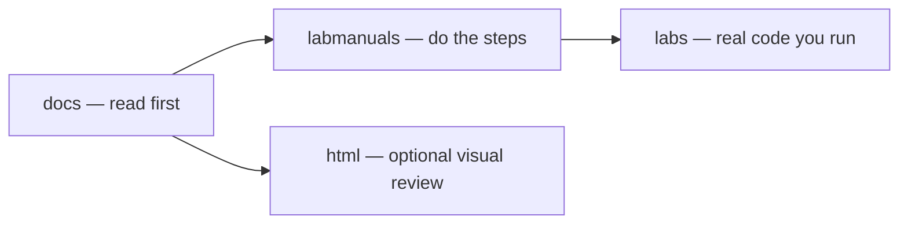

# Terraform & Ansible Labs

Hands-on curriculum for **configuration management** and **infrastructure as code**: a **20-hour essentials bootcamp** (10 h Ansible + 10 h Terraform) plus optional extended tracks for self-paced depth.

**Repository:** [github.com/devopscert202/terraform-ansible-labs](https://github.com/devopscert202/terraform-ansible-labs)

---

## Who this is for

You are learning to automate servers with **Ansible** and provision cloud resources with **Terraform**. No prior CM/IaC experience required if you complete the setup guide first.

| Track | Time | Labs | Outcome |
|-------|------|------|---------|
| [Ansible essentials](ansible/essentials/labmanuals/) | 10 h | 7 | Inventory, playbooks, roles, vault |
| [Terraform essentials](terraform/essentials/labmanuals/) | 10 h | 8 | Init, EC2, variables, state, modules |
| [Ansible extended](ansible/extended/labmanuals/) | self-paced | 9 | Facts, loops, dynamic inventory, drills |
| [Terraform extended](terraform/extended/labmanuals/) | self-paced | 15 | Provisioners, remote state, capstones |

---

## Quick start (do this once)

### 1. Clone the repo

```bash
git clone https://github.com/devopscert202/terraform-ansible-labs.git
cd terraform-ansible-labs
```

### 2. Provision your lab environment

Follow **[curriculum/setup/aws-lab-environment.md](curriculum/setup/aws-lab-environment.md)** — one EC2 control node (Ubuntu 22.04) plus target nodes. Allow **SSH port 22** in your security group.

### 3. Install tools on the control node

```bash
# Ansible
sudo apt update && sudo apt install -y ansible

# Terraform 1.5+
wget -qO- https://apt.releases.hashicorp.com/gpg | sudo gpg --dearmor -o /usr/share/keyrings/hashicorp-archive-keyring.gpg
echo "deb [signed-by=/usr/share/keyrings/hashicorp-archive-keyring.gpg] https://apt.releases.hashicorp.com $(lsb_release -cs) main" | sudo tee /etc/apt/sources.list.d/hashicorp.list
sudo apt update && sudo apt install -y terraform

# AWS CLI (for Terraform AWS labs)
sudo apt install -y awscli
export AWS_PROFILE=your-lab-profile   # or use an IAM role on EC2
aws sts get-caller-identity
```

### 4. Start the bootcamp

1. Read [curriculum/20-hour-bootcamp.md](curriculum/20-hour-bootcamp.md)
2. Open [Ansible essentials lab 01](ansible/essentials/labmanuals/lab01-inventory-static-hosts.md)
3. After Ansible lab 07, continue with [Terraform essentials lab 01](terraform/essentials/labmanuals/lab01-providers-init.md)

---

## How this repo is organized

Every technology track has **three pillars**. Use them in this order:



| Pillar | Path pattern | What you do |
|--------|--------------|-------------|
| **Concept docs** | `{ansible,terraform}/{essentials,extended}/docs/` | Read theory, diagrams, and prerequisites **before** the matching lab |
| **Lab manuals** | `*/labmanuals/labNN-*.md` | Follow step-by-step instructions; each step has a **Validate** block |
| **Lab code** | `*/labs/` | Runnable playbooks, roles, inventory, and `.tf` files — **do not paste long configs from the manual**; edit files here |
| **HTML guides** | `*/html/index.html` | Offline interactive pages — open in a browser for visual learners |

**Curriculum** (agendas, setup, QA): [curriculum/](curriculum/)

---

## How to use lab manuals

Lab manuals are Markdown files under `labmanuals/`. Each essentials lab is **80–180 lines** — scannable, with validation after every step.

### Typical workflow

1. Open the lab manual (e.g. `ansible/essentials/labmanuals/lab04-playbook-apache-webserver.md`)
2. `cd` into the matching `labs/` directory noted in the manual
3. Run each command exactly as shown
4. Check the **Validate** block — compare your output
5. Complete **Done when** checklist before moving on
6. Run **Cleanup** at the end (remove packages, `terraform destroy`, etc.)

### Ansible-specific

```bash
cd ~/terraform-ansible-labs/ansible/essentials/labs

# One-time: copy inventory template and set your private IPs
cp inventory/hosts.ini.local.example inventory/hosts.ini.local
# edit hosts.ini.local — replace 10.0.1.x with your node IPs

# Run a playbook (example lab 04)
ansible-playbook -i inventory/hosts.ini.local playbooks/apache.yml
```

- Inventory vars live in `inventory/group_vars/` (next to the inventory file)
- Extended track working directory: `ansible/extended/labs/`

### Terraform-specific

```bash
cd ~/terraform-ansible-labs/terraform/essentials/labs/lab02-ec2

cp terraform.tfvars.example terraform.tfvars   # when provided
# edit terraform.tfvars — set ssh_cidr to your IP/32

terraform init
terraform validate
terraform plan
terraform apply
# when finished:
terraform destroy
```

- **Never** put AWS access keys in `.tf` files — use `AWS_PROFILE` or an IAM role
- Do not commit `.terraform/`, `terraform.tfstate*`, or private `*.tfvars`

---

## How to use HTML files

HTML pages are **self-contained** (embedded CSS, no CDN). Open them locally:

```bash
# macOS
open ansible/essentials/html/index.html

# Linux — or serve the folder
python3 -m http.server 8765 --directory ansible/essentials/html
# browse to http://localhost:8765
```

Use HTML **before or after** the matching lab — not instead of doing the hands-on steps.

| Catalog | Opens |
|---------|--------|
| [Ansible essentials HTML](ansible/essentials/html/index.html) | Architecture, inventory, playbooks, variables, roles, vault |
| [Ansible extended HTML](ansible/extended/html/index.html) | Loops, facts, dynamic inventory, break-fix |
| [Terraform essentials HTML](terraform/essentials/html/index.html) | Workflow, variables, state, modules |
| [Terraform extended HTML](terraform/extended/html/index.html) | Provisioners, state, functions, capstones |

---

## Full index — Ansible

### Essentials (10-hour bootcamp)

| Lab | Manual | Lab code | Topic |
|-----|--------|----------|-------|
| 01 | [lab01](ansible/essentials/labmanuals/lab01-inventory-static-hosts.md) | [labs/inventory/](ansible/essentials/labs/inventory/) | Static inventory |
| 02 | [lab02](ansible/essentials/labmanuals/lab02-inventory-hosts-groups.md) | [labs/inventory/](ansible/essentials/labs/inventory/) | Hosts and groups |
| 03 | [lab03](ansible/essentials/labmanuals/lab03-adhoc-commands.md) | [labs/](ansible/essentials/labs/) | Ad hoc commands |
| 04 | [lab04](ansible/essentials/labmanuals/lab04-playbook-apache-webserver.md) | [playbooks/apache.yml](ansible/essentials/labs/playbooks/apache.yml) | Apache + handlers |
| 05 | [lab05](ansible/essentials/labmanuals/lab05-playbook-variables.md) | [playbooks/vars-demo.yml](ansible/essentials/labs/playbooks/vars-demo.yml) | Variables + templates |
| 06 | [lab06](ansible/essentials/labmanuals/lab06-roles-create.md) | [roles/webserver/](ansible/essentials/labs/roles/webserver/) | Roles |
| 07 | [lab07](ansible/essentials/labmanuals/lab07-vault-and-nodejs-capstone.md) | [playbooks/nodejs.yml](ansible/essentials/labs/playbooks/nodejs.yml) | Vault + Node.js capstone |

**Docs:** [ansible/essentials/docs/](ansible/essentials/docs/README.md) · **HTML:** [ansible/essentials/html/index.html](ansible/essentials/html/index.html)

### Extended (optional)

| Lab | Manual | Topic |
|-----|--------|-------|
| 01 | [lab01-adhoc-modules.md](ansible/extended/labmanuals/lab01-adhoc-modules.md) | Ad hoc modules deep dive |
| 02 | [lab02-facts.md](ansible/extended/labmanuals/lab02-facts.md) | Facts + custom facts |
| 03 | [lab03-nodejs-playbook.md](ansible/extended/labmanuals/lab03-nodejs-playbook.md) | Standalone Node.js playbook |
| 04 | [lab04-loops.md](ansible/extended/labmanuals/lab04-loops.md) | Loops |
| 05 | [lab05-conditionals.md](ansible/extended/labmanuals/lab05-conditionals.md) | Conditionals |
| 06 | [lab06-handlers.md](ansible/extended/labmanuals/lab06-handlers.md) | Handlers |
| 07 | [lab07-dynamic-inventory.md](ansible/extended/labmanuals/lab07-dynamic-inventory.md) | AWS dynamic inventory |
| 08 | [lab08-roles-project.md](ansible/extended/labmanuals/lab08-roles-project.md) | Roles capstone project |
| 09 | [lab09-break-fix-drills.md](ansible/extended/labmanuals/lab09-break-fix-drills.md) | Break-fix troubleshooting |

**Lab code:** [ansible/extended/labs/](ansible/extended/labs/) · **Docs:** [ansible/extended/docs/](ansible/extended/docs/README.md) · **HTML:** [ansible/extended/html/index.html](ansible/extended/html/index.html)

---

## Full index — Terraform

### Essentials (10-hour bootcamp)

| Lab | Manual | Lab directory | Topic |
|-----|--------|---------------|-------|
| 01 | [lab01-providers-init.md](terraform/essentials/labmanuals/lab01-providers-init.md) | [lab01-providers-init/](terraform/essentials/labs/lab01-providers-init/) | Providers + init |
| 02 | [lab02-ec2.md](terraform/essentials/labmanuals/lab02-ec2.md) | [lab02-ec2/](terraform/essentials/labs/lab02-ec2/) | EC2 instance |
| 03 | [lab03-plan-apply-destroy.md](terraform/essentials/labmanuals/lab03-plan-apply-destroy.md) | [lab03-plan-apply-destroy/](terraform/essentials/labs/lab03-plan-apply-destroy/) | Plan / apply / destroy |
| 04 | [lab04-fmt-validate.md](terraform/essentials/labmanuals/lab04-fmt-validate.md) | [lab04-fmt-validate/](terraform/essentials/labs/lab04-fmt-validate/) | fmt + validate |
| 05 | [lab05-variables.md](terraform/essentials/labmanuals/lab05-variables.md) | [lab05-variables/](terraform/essentials/labs/lab05-variables/) | Variables + outputs |
| 06 | [lab06-local-state.md](terraform/essentials/labmanuals/lab06-local-state.md) | [lab06-local-state/](terraform/essentials/labs/lab06-local-state/) | Local state |
| 07 | [lab07-simple-module.md](terraform/essentials/labmanuals/lab07-simple-module.md) | [lab07-simple-module/](terraform/essentials/labs/lab07-simple-module/) | Simple module |
| 08 | [lab08-tfvars-secrets.md](terraform/essentials/labmanuals/lab08-tfvars-secrets.md) | [lab08-tfvars-secrets/](terraform/essentials/labs/lab08-tfvars-secrets/) | tfvars + secrets |

**Docs:** [terraform/essentials/docs/](terraform/essentials/docs/01-getting-started/README.md) · **HTML:** [terraform/essentials/html/index.html](terraform/essentials/html/index.html)

### Extended (optional)

| Lab | Manual | Lab directory |
|-----|--------|---------------|
| 01 | [lab01-console-vpc.md](terraform/extended/labmanuals/lab01-console-vpc.md) | [lab01-console-vpc/](terraform/extended/labs/lab01-console-vpc/) (reference) |
| 02 | [lab02-validate-only.md](terraform/extended/labmanuals/lab02-validate-only.md) | [lab02-validate-only/](terraform/extended/labs/lab02-validate-only/) |
| 03 | [lab03-multi-cloud-providers.md](terraform/extended/labmanuals/lab03-multi-cloud-providers.md) | [lab03-multi-cloud-providers/](terraform/extended/labs/lab03-multi-cloud-providers/) |
| 04 | [lab04-local-exec-provisioner.md](terraform/extended/labmanuals/lab04-local-exec-provisioner.md) | [lab04-local-exec-provisioner/](terraform/extended/labs/lab04-local-exec-provisioner/) |
| 05 | [lab05-remote-exec-provisioner.md](terraform/extended/labmanuals/lab05-remote-exec-provisioner.md) | [lab05-remote-exec-provisioner/](terraform/extended/labs/lab05-remote-exec-provisioner/) |
| 06 | [lab06-workspaces.md](terraform/extended/labmanuals/lab06-workspaces.md) | [lab06-workspaces/](terraform/extended/labs/lab06-workspaces/) |
| 07 | [lab07-s3-backend.md](terraform/extended/labmanuals/lab07-s3-backend.md) | [lab07-s3-backend/](terraform/extended/labs/lab07-s3-backend/) |
| 08 | [lab08-state-keys.md](terraform/extended/labmanuals/lab08-state-keys.md) | [lab08-state-keys/](terraform/extended/labs/lab08-state-keys/) |
| 09 | [lab09-state-locking.md](terraform/extended/labmanuals/lab09-state-locking.md) | [lab09-state-locking/](terraform/extended/labs/lab09-state-locking/) |
| 10 | [lab10-state-migration.md](terraform/extended/labmanuals/lab10-state-migration.md) | [lab10-state-migration/](terraform/extended/labs/lab10-state-migration/) |
| 11 | [lab11-remote-state-consumer.md](terraform/extended/labmanuals/lab11-remote-state-consumer.md) | [lab11-remote-state-consumer/](terraform/extended/labs/lab11-remote-state-consumer/) |
| 12 | [lab12-collections.md](terraform/extended/labmanuals/lab12-collections.md) | [lab12-collections/](terraform/extended/labs/lab12-collections/) |
| 13 | [lab13-functions.md](terraform/extended/labmanuals/lab13-functions.md) | [lab13-functions/](terraform/extended/labs/lab13-functions/) |
| 14 | [lab14-dynamic-blocks.md](terraform/extended/labmanuals/lab14-dynamic-blocks.md) | [lab14-dynamic-blocks/](terraform/extended/labs/lab14-dynamic-blocks/) |
| 15 | [lab15-capstone-projects.md](terraform/extended/labmanuals/lab15-capstone-projects.md) | [lab15-capstone-projects/](terraform/extended/labs/lab15-capstone-projects/) |

**Docs:** [terraform/extended/docs/](terraform/extended/docs/state/README.md) · **HTML:** [terraform/extended/html/index.html](terraform/extended/html/index.html)

---

## Curriculum & shared resources

| Resource | Purpose |
|----------|---------|
| [20-hour bootcamp agenda](curriculum/20-hour-bootcamp.md) | Minute-by-minute instructor schedule |
| [Day-wise LVC agenda](curriculum/day-wise-agenda.md) | Full 4-day reference |
| [Learning paths](curriculum/learning-paths.md) | Essentials vs extended routes |
| [AWS lab environment](curriculum/setup/aws-lab-environment.md) | EC2 setup (read first) |
| [WebApp Co scenario](ansible/projects/webapp-co/README.md) | Shared narrative across tracks |
| [QA report](curriculum/qa-report.md) | Validation sign-off |

---

## Repository layout

```
terraform-ansible-labs/
├── README.md                 ← you are here
├── curriculum/               Agendas, AWS setup, QA
├── ansible/
│   ├── essentials/           10-hour track (lab01–07)
│   │   ├── docs/             Concept reading
│   │   ├── labmanuals/       Step-by-step labs
│   │   ├── labs/             Playbooks, roles, inventory
│   │   └── html/             Offline interactive guides
│   ├── extended/             Optional depth (lab01–09)
│   └── projects/webapp-co/   Shared scenario
└── terraform/
    ├── essentials/           10-hour track (lab01–08)
    └── extended/             Optional depth (lab01–15)
```

---

## Tips for learners

- **Read docs → do lab manual → run code in `labs/`** — that order every time
- **Validate after every step** — if output does not match, stop and fix before continuing
- **Re-run playbooks** to see idempotency (`changed=0` on second run)
- **`terraform destroy`** after every AWS lab to avoid charges
- **Never commit** `.vault_pass`, `*.tfvars` with secrets, `terraform.tfstate`, or `.terraform/`
- Stuck? Check **If something fails** tables in each lab manual

---

## Requirements

| Tool | Version |
|------|---------|
| Ansible | 2.14+ (Ubuntu 22.04 packages OK) |
| Terraform | 1.5+ |
| AWS CLI | v2 (Terraform AWS labs) |
| Target OS | Ubuntu 22.04 LTS |

---

## License

Educational use. Lab content adapted for modern tooling (Terraform AWS provider ~> 5.0, Ansible FQCN, Node.js 20 LTS).
