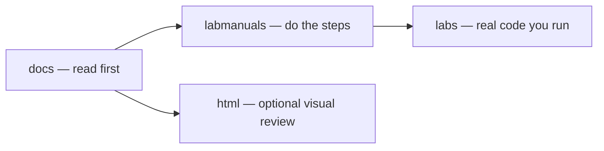

# Terraform & Ansible Labs

Hands-on curriculum for **configuration management** and **infrastructure as code**: a **20-hour bootcamp** (10 h Ansible + 10 h Terraform) plus self-paced depth in both tracks.

**Repository:** [github.com/devopscert202/terraform-ansible-labs](https://github.com/devopscert202/terraform-ansible-labs)

**Browse online (GitHub Pages):** [devopscert202.github.io/terraform-ansible-labs](https://devopscert202.github.io/terraform-ansible-labs/)

| HTML catalog | Live link |
|--------------|-----------|
| Ansible essentials | [open](https://devopscert202.github.io/terraform-ansible-labs/ansible/essentials/html/index.html) |
| Ansible extended | [open](https://devopscert202.github.io/terraform-ansible-labs/ansible/extended/html/index.html) |
| Terraform track (25 labs) | [open](https://devopscert202.github.io/terraform-ansible-labs/terraform/html/index.html) |
| Terraform 101 (read first) | [open](https://devopscert202.github.io/terraform-ansible-labs/terraform/html/terraform-101.html) |
| Terraform AWS primer (read second) | [open](https://devopscert202.github.io/terraform-ansible-labs/terraform/html/aws-primer.html) |

---

## Who this is for

You are learning to automate servers with **Ansible** and provision cloud resources with **Terraform**. No prior CM/IaC experience required if you complete the setup guide first.

| Track | Time | Labs | Outcome |
|-------|------|------|---------|
| [Ansible essentials](ansible/essentials/labmanuals/) | 10 h | 7 | Inventory, playbooks, roles, vault |
| [Terraform Basic](terraform/labmanuals/README.md#tier-1--basic-lab00lab05) | 10 h (with early Intermediate) | 6 | Credentials, providers, first EC2, the core workflow, `fmt` and `validate` |
| [Ansible extended](ansible/extended/labmanuals/) | self-paced | 9 | Facts, loops, dynamic inventory, drills |
| [Terraform Intermediate](terraform/labmanuals/README.md#tier-2--intermediate-lab06lab12) | self-paced | 7 | Variables, tfvars and secrets, state, modules, the capstone at `lab10`, collections, functions |
| [Terraform Advanced](terraform/labmanuals/README.md#tier-3--advanced-lab13lab24) | self-paced | 12 | Multiple providers, provisioners, workspaces, S3 backend with locking, migration, remote state, dynamic blocks, the capstone on a remote backend, S3 buckets |

New to Terraform? Two primers come before lab00, in this order: **[Terraform 101](terraform/html/terraform-101.html)** (what Terraform is, HCL, providers, version constraints, state, drift), then the **[AWS primer](terraform/html/aws-primer.html)** (region, VPC, subnet, gateway, security group, EC2, IAM keys).

---

## Quick start (do this once)

### 1. Clone the repo

```bash
git clone https://github.com/devopscert202/terraform-ansible-labs.git
cd terraform-ansible-labs
```

### 2. Provision your lab environment

Follow **[curriculum/setup/aws-lab-environment.md](curriculum/setup/aws-lab-environment.md)** — one EC2 control node (Ubuntu 22.04) plus target nodes. Allow **SSH port 22** in your security group.

### 3. Install tools on the control node

```bash
# Ansible
sudo apt update && sudo apt install -y ansible

# Terraform 1.5+
wget -qO- https://apt.releases.hashicorp.com/gpg | sudo gpg --dearmor -o /usr/share/keyrings/hashicorp-archive-keyring.gpg
echo "deb [signed-by=/usr/share/keyrings/hashicorp-archive-keyring.gpg] https://apt.releases.hashicorp.com $(lsb_release -cs) main" | sudo tee /etc/apt/sources.list.d/hashicorp.list
sudo apt update && sudo apt install -y terraform

# AWS CLI (for Terraform AWS labs)
sudo apt install -y awscli
export AWS_PROFILE=your-lab-profile   # or use an IAM role on EC2
aws sts get-caller-identity
```

### 4. Start the bootcamp

1. Read [curriculum/20-hour-bootcamp.md](curriculum/20-hour-bootcamp.md)
2. Open [Ansible essentials lab 01](ansible/essentials/labmanuals/lab01-inventory-static-hosts.md)
3. After Ansible lab 07, continue with [Terraform lab 00](terraform/labmanuals/lab00-aws-setup-and-init.md)

---

## How this repo is organized

Every technology track has **three pillars**. Use them in this order:


```mermaid
flowchart LR
  docs[docs — read first] --> manuals[labmanuals — do the steps]
  manuals --> labs[labs — real code you run]
  docs --> html[html — optional visual review]
```

| Pillar | Ansible path | Terraform path | What you do |
|--------|--------------|----------------|-------------|
| **Concept docs** | `ansible/{essentials,extended}/docs/` | `terraform/docs/{basic,intermediate,advanced}/` | Read theory before the matching lab |
| **Lab manuals** | `ansible/*/labmanuals/labNN-*.md` | `terraform/labmanuals/labNN-*.md` | Follow the steps; every command has expected output |
| **Lab code** | `ansible/*/labs/` | `terraform/labs/labNN-*/` | Runnable playbooks, roles, inventory, and `.tf` files — edit files here rather than pasting from the manual |
| **HTML guides** | `ansible/*/html/index.html` | `terraform/html/index.html` | Offline self-contained pages for visual learners. The Terraform set is six pages: two primers, the catalog, and one per tier |

The Terraform track is **flat**: one `labmanuals/`, one `labs/`, one `html/`, and `docs/` split into the three tiers. The old essentials-and-extended split under `terraform/` is gone, so `terraform/html/` is now two levels below the repo root rather than three.

**Curriculum** (agendas, setup, QA): [curriculum/](curriculum/)

---

## How to use lab manuals

Lab manuals are Markdown files under `labmanuals/`. Terraform manuals are step-by-step with the real expected output after every command; length follows the lab's content rather than a line budget.

### Typical workflow

1. Open the lab manual (e.g. `ansible/essentials/labmanuals/lab04-playbook-apache-webserver.md`)
2. `cd` into the matching `labs/` directory noted in the manual
3. Run each command exactly as shown
4. Check the **Validate** block — compare your output
5. Complete **Done when** checklist before moving on
6. Run **Cleanup** at the end (remove packages, `terraform destroy`, etc.)

### Ansible-specific

```bash
cd ~/terraform-ansible-labs/ansible/essentials/labs

# One-time: copy inventory template and set your private IPs
cp inventory/hosts.ini.local.example inventory/hosts.ini.local
# edit hosts.ini.local — replace 10.0.1.x with your node IPs

# Run a playbook (example lab 04)
ansible-playbook -i inventory/hosts.ini.local playbooks/apache.yml
```

- Inventory vars live in `inventory/group_vars/` (next to the inventory file)
- Extended track working directory: `ansible/extended/labs/`

### Terraform-specific

```bash
cd ~/terraform-ansible-labs/terraform/labs/lab03-first-ec2

cp terraform.tfvars.example terraform.tfvars   # when provided
# edit terraform.tfvars — set ssh_cidr to your IP/32

terraform init
terraform validate
terraform plan
terraform apply
# when finished:
terraform destroy
```

- **Never** put AWS access keys in `.tf` files — export them, or use `AWS_PROFILE` or an IAM role
- Do not commit `.terraform/`, `.terraform.lock.hcl`, `terraform.tfstate*`, or real `*.tfvars`
- Region `us-east-2`, instance type `t3.micro`, AMIs resolved via `data "aws_ami"` — never a hardcoded ID

---

## How to use HTML files

HTML pages are **self-contained** (embedded CSS, no CDN). You can open them locally **or** browse on GitHub Pages after each push to `main`:

**Live catalogs:** [devopscert202.github.io/terraform-ansible-labs](https://devopscert202.github.io/terraform-ansible-labs/)

```bash
# macOS (local)
open ansible/essentials/html/index.html

# Linux — or serve the folder locally
python3 -m http.server 8765 --directory ansible/essentials/html
# browse to http://localhost:8765
```

Use HTML **before or after** the matching lab — not instead of doing the hands-on steps.

| Catalog | Opens |
|---------|--------|
| [Ansible essentials HTML](ansible/essentials/html/index.html) | Architecture, inventory, playbooks, variables, roles, vault |
| [Ansible extended HTML](ansible/extended/html/index.html) | Loops, facts, dynamic inventory, break-fix |
| [Terraform track catalog](terraform/html/index.html) | Tier cards, all 25 labs, searchable lab table |
| [Terraform 101](terraform/html/terraform-101.html) | **Read first.** What Terraform is and who owns it, HCL and block anatomy, providers, every version-constraint operator, the CLI and plan symbols, state, drift |
| [Terraform AWS primer](terraform/html/aws-primer.html) | **Read second.** AWS concepts from scratch plus the capstone architecture diagram |
| [Terraform Basic](terraform/html/basic.html) | Credentials, providers, resources, the core workflow, quality gates |
| [Terraform Intermediate](terraform/html/intermediate.html) | Variables, tfvars, state, modules, the capstone, collections, functions |
| [Terraform Advanced](terraform/html/advanced.html) | Multiple providers, provisioners, workspaces, remote state, dynamic blocks, S3 |

---

## Full index — Ansible

### Essentials (10-hour bootcamp)

| Lab | Manual | Lab code | Topic |
|-----|--------|----------|-------|
| 01 | [lab01](ansible/essentials/labmanuals/lab01-inventory-static-hosts.md) | [labs/inventory/](ansible/essentials/labs/inventory/) | Static inventory |
| 02 | [lab02](ansible/essentials/labmanuals/lab02-inventory-hosts-groups.md) | [labs/inventory/](ansible/essentials/labs/inventory/) | Hosts and groups |
| 03 | [lab03](ansible/essentials/labmanuals/lab03-adhoc-commands.md) | [labs/](ansible/essentials/labs/) | Ad hoc commands |
| 04 | [lab04](ansible/essentials/labmanuals/lab04-playbook-apache-webserver.md) | [playbooks/apache.yml](ansible/essentials/labs/playbooks/apache.yml) | Apache + handlers |
| 05 | [lab05](ansible/essentials/labmanuals/lab05-playbook-variables.md) | [playbooks/vars-demo.yml](ansible/essentials/labs/playbooks/vars-demo.yml) | Variables + templates |
| 06 | [lab06](ansible/essentials/labmanuals/lab06-roles-create.md) | [roles/webserver/](ansible/essentials/labs/roles/webserver/) | Roles |
| 07 | [lab07](ansible/essentials/labmanuals/lab07-vault-and-nodejs-capstone.md) | [playbooks/nodejs.yml](ansible/essentials/labs/playbooks/nodejs.yml) | Vault + Node.js capstone |

**Docs:** [ansible/essentials/docs/](ansible/essentials/docs/README.md) · **HTML:** [ansible/essentials/html/index.html](ansible/essentials/html/index.html)

### Extended (optional)

| Lab | Manual | Topic |
|-----|--------|-------|
| 01 | [lab01-adhoc-modules.md](ansible/extended/labmanuals/lab01-adhoc-modules.md) | Ad hoc modules deep dive |
| 02 | [lab02-facts.md](ansible/extended/labmanuals/lab02-facts.md) | Facts + custom facts |
| 03 | [lab03-nodejs-playbook.md](ansible/extended/labmanuals/lab03-nodejs-playbook.md) | Standalone Node.js playbook |
| 04 | [lab04-loops.md](ansible/extended/labmanuals/lab04-loops.md) | Loops |
| 05 | [lab05-conditionals.md](ansible/extended/labmanuals/lab05-conditionals.md) | Conditionals |
| 06 | [lab06-handlers.md](ansible/extended/labmanuals/lab06-handlers.md) | Handlers |
| 07 | [lab07-dynamic-inventory.md](ansible/extended/labmanuals/lab07-dynamic-inventory.md) | AWS dynamic inventory |
| 08 | [lab08-roles-project.md](ansible/extended/labmanuals/lab08-roles-project.md) | Roles capstone project |
| 09 | [lab09-break-fix-drills.md](ansible/extended/labmanuals/lab09-break-fix-drills.md) | Break-fix troubleshooting |

**Lab code:** [ansible/extended/labs/](ansible/extended/labs/) · **Docs:** [ansible/extended/docs/](ansible/extended/docs/README.md) · **HTML:** [ansible/extended/html/index.html](ansible/extended/html/index.html)

---

## Full index — Terraform

**25 labs, `lab00`–`lab24`.** Full table with tier and topic columns: [terraform/labmanuals/README.md](terraform/labmanuals/README.md). Track landing page: [terraform/README.md](terraform/README.md).

### Tier 1 — Basic (lab00–lab05, instructor-led)

| Lab | Manual | Lab directory | Topic |
|-----|--------|---------------|-------|
| 00 | [lab00-aws-setup-and-init.md](terraform/labmanuals/lab00-aws-setup-and-init.md) | [lab00-aws-setup-and-init/](terraform/labs/lab00-aws-setup-and-init/) | AWS credentials, provider block, first `init` |
| 01 | [lab01-providers-init.md](terraform/labmanuals/lab01-providers-init.md) | [lab01-providers-init/](terraform/labs/lab01-providers-init/) | `required_providers`, lock file, `validate` |
| 02 | [lab02-console-vpc.md](terraform/labmanuals/lab02-console-vpc.md) | [lab02-console-vpc/](terraform/labs/lab02-console-vpc/) | Console build, contrasted with IaC (no `.tf`) |
| 03 | [lab03-first-ec2.md](terraform/labmanuals/lab03-first-ec2.md) | [lab03-first-ec2/](terraform/labs/lab03-first-ec2/) | AMI data source, security group, instance |
| 04 | [lab04-plan-apply-destroy.md](terraform/labmanuals/lab04-plan-apply-destroy.md) | [lab04-plan-apply-destroy/](terraform/labs/lab04-plan-apply-destroy/) | The core workflow, no cloud cost |
| 05 | [lab05-fmt-validate.md](terraform/labmanuals/lab05-fmt-validate.md) | [lab05-fmt-validate/](terraform/labs/lab05-fmt-validate/) | `fmt`, `validate`, CI-style gates |

**Docs:** [terraform/docs/basic/](terraform/docs/README.md) · **Concepts:** [terraform/html/basic.html](terraform/html/basic.html)

### Tier 2 — Intermediate (lab06–lab12)

| Lab | Manual | Lab directory | Topic |
|-----|--------|---------------|-------|
| 06 | [lab06-variables-outputs.md](terraform/labmanuals/lab06-variables-outputs.md) | [lab06-variables-outputs/](terraform/labs/lab06-variables-outputs/) | Typed inputs, locals, outputs |
| 07 | [lab07-tfvars-secrets.md](terraform/labmanuals/lab07-tfvars-secrets.md) | [lab07-tfvars-secrets/](terraform/labs/lab07-tfvars-secrets/) | tfvars, precedence, `sensitive` |
| 08 | [lab08-local-state.md](terraform/labmanuals/lab08-local-state.md) | [lab08-local-state/](terraform/labs/lab08-local-state/) | `terraform.tfstate`, refresh, drift |
| 09 | [lab09-modules.md](terraform/labmanuals/lab09-modules.md) | [lab09-modules/](terraform/labs/lab09-modules/) | Child modules, inputs, outputs |
| 10 | [lab10-capstone-vpc-ec2.md](terraform/labmanuals/lab10-capstone-vpc-ec2.md) | [lab10-capstone-vpc-ec2/](terraform/labs/lab10-capstone-vpc-ec2/) | Capstone: VPC, IGW, subnet, route table, SG, EC2 |
| 11 | [lab11-collections.md](terraform/labmanuals/lab11-collections.md) | [lab11-collections/](terraform/labs/lab11-collections/) | `for_each` over maps and sets |
| 12 | [lab12-functions.md](terraform/labmanuals/lab12-functions.md) | [lab12-functions/](terraform/labs/lab12-functions/) | String, collection, CIDR, encoding |

**Docs:** [terraform/docs/intermediate/](terraform/docs/README.md) · **Concepts:** [terraform/html/intermediate.html](terraform/html/intermediate.html)

### Tier 3 — Advanced (lab13–lab24)

| Lab | Manual | Lab directory | Topic |
|-----|--------|---------------|-------|
| 13 | [lab13-multi-provider.md](terraform/labmanuals/lab13-multi-provider.md) | [lab13-multi-provider/](terraform/labs/lab13-multi-provider/) | Two providers, aliases |
| 14 | [lab14-local-exec-provisioner.md](terraform/labmanuals/lab14-local-exec-provisioner.md) | [lab14-local-exec-provisioner/](terraform/labs/lab14-local-exec-provisioner/) | Command on the Terraform host |
| 15 | [lab15-remote-exec-provisioner.md](terraform/labmanuals/lab15-remote-exec-provisioner.md) | [lab15-remote-exec-provisioner/](terraform/labs/lab15-remote-exec-provisioner/) | SSH `connection`, inline commands |
| 16 | [lab16-workspaces.md](terraform/labmanuals/lab16-workspaces.md) | [lab16-workspaces/](terraform/labs/lab16-workspaces/) | `terraform.workspace` |
| 17 | [lab17-s3-backend.md](terraform/labmanuals/lab17-s3-backend.md) | [lab17-s3-backend/](terraform/labs/lab17-s3-backend/) | Remote state in S3 |
| 18 | [lab18-state-keys-locking.md](terraform/labmanuals/lab18-state-keys-locking.md) | [lab18-state-keys-locking/](terraform/labs/lab18-state-keys-locking/) | Key conventions, native S3 locking |
| 19 | [lab19-state-migration.md](terraform/labmanuals/lab19-state-migration.md) | [lab19-state-migration/](terraform/labs/lab19-state-migration/) | `init -migrate-state` |
| 20 | [lab20-remote-state-consumer.md](terraform/labmanuals/lab20-remote-state-consumer.md) | [lab20-remote-state-consumer/](terraform/labs/lab20-remote-state-consumer/) | `terraform_remote_state` |
| 21 | [lab21-dynamic-blocks.md](terraform/labmanuals/lab21-dynamic-blocks.md) | [lab21-dynamic-blocks/](terraform/labs/lab21-dynamic-blocks/) | Generated nested blocks |
| 22 | [lab22-ec2-s3-backend.md](terraform/labmanuals/lab22-ec2-s3-backend.md) | [lab22-ec2-s3-backend/](terraform/labs/lab22-ec2-s3-backend/) | The capstone build, state kept in S3 |
| 23 | [lab23-s3-bucket.md](terraform/labmanuals/lab23-s3-bucket.md) | [lab23-s3-bucket/](terraform/labs/lab23-s3-bucket/) | `aws_s3_bucket`, versioning, encryption |
| 24 | [lab24-count-foreach-buckets.md](terraform/labmanuals/lab24-count-foreach-buckets.md) | [lab24-count-foreach-buckets/](terraform/labs/lab24-count-foreach-buckets/) | `count` by position vs `for_each` by name |

**Docs:** [terraform/docs/advanced/](terraform/docs/README.md) · **Concepts:** [terraform/html/advanced.html](terraform/html/advanced.html)

---

## Curriculum & shared resources

| Resource | Purpose |
|----------|---------|
| [20-hour bootcamp agenda](curriculum/20-hour-bootcamp.md) | Minute-by-minute instructor schedule |
| [Day-wise LVC agenda](curriculum/day-wise-agenda.md) | Full 4-day reference |
| [Learning paths](curriculum/learning-paths.md) | Instructor-led vs self-paced routes |
| [AWS lab environment](curriculum/setup/aws-lab-environment.md) | EC2 setup (read first) |
| [WebApp Co scenario](ansible/projects/webapp-co/README.md) | Shared narrative across tracks |
| [QA report](curriculum/qa-report.md) | Validation sign-off |

---

## Repository layout

```
terraform-ansible-labs/
├── README.md                 ← you are here
├── curriculum/               Agendas, AWS setup, HTML generators, QA
├── ansible/
│   ├── essentials/           10-hour track (lab01–07)
│   │   ├── docs/             Concept reading
│   │   ├── labmanuals/       Step-by-step labs
│   │   ├── labs/             Playbooks, roles, inventory
│   │   └── html/             Offline interactive guides
│   ├── extended/             Optional depth (lab01–09)
│   └── projects/webapp-co/   Shared scenario
└── terraform/                One flat track, 25 labs in 3 tiers
    ├── labmanuals/           lab00–lab24 + README.md (the lab index)
    ├── labs/                 lab00-*/ … lab24-*/, one root module each
    ├── docs/                 basic/ intermediate/ advanced/
    └── html/                 index, terraform-101, aws-primer, basic, intermediate, advanced
```

Terraform tiers: **Basic** `lab00`–`lab05` (6 labs), **Intermediate** `lab06`–`lab12` (7, capstone at `lab10`), **Advanced** `lab13`–`lab24` (12).

---

## Tips for learners

- **Read docs → do lab manual → run code in `labs/`** — that order every time
- **Validate after every step** — if output does not match, stop and fix before continuing
- **Re-run playbooks** to see idempotency (`changed=0` on second run)
- **`terraform destroy`** after every AWS lab to avoid charges
- **Never commit** `.vault_pass`, `*.tfvars` with secrets, `terraform.tfstate`, or `.terraform/`
- Stuck? Check **If something fails** tables in each lab manual

---

## Requirements

| Tool | Version |
|------|---------|
| Ansible | 2.14+ (Ubuntu 22.04 packages OK) |
| Terraform | 1.5+, and 1.11+ for `lab17`–`lab19` and `lab22` |
| AWS CLI | v2 (Terraform AWS labs) |
| Target OS | Ubuntu 22.04 LTS |

---

## License

Educational use. Lab content adapted for modern tooling (Terraform AWS provider ~> 5.0, Ansible FQCN, Node.js 20 LTS).
