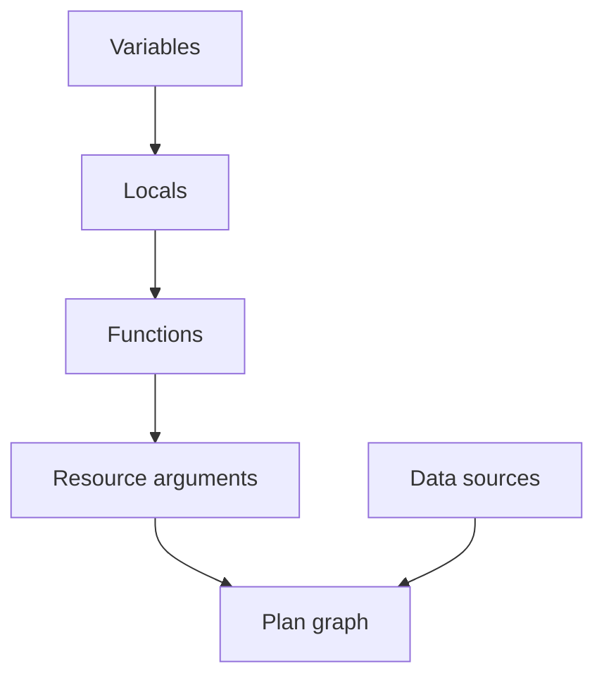
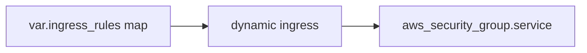

# Functions, Expressions, and Collections

Terraform's configuration language evaluates expressions at plan time. Functions transform values; they never create infrastructure. Labs 12–14 cover collections, built-in functions, and dynamic blocks.

## Table of contents

1. [Expression evaluation model](#expression-evaluation-model)
2. [String functions](#string-functions)
3. [Collection functions](#collection-functions)
4. [Numeric and CIDR functions](#numeric-and-cidr-functions)
5. [Encoding functions](#encoding-functions)
6. [for_each vs count](#for_each-vs-count)
7. [Dynamic blocks](#dynamic-blocks)
8. [terraform console](#terraform-console)
9. [Troubleshooting](#troubleshooting)
10. [Lab cross-reference](#lab-cross-reference)

## Expression evaluation model



Unknown values (computed at apply) propagate until providers resolve them.

## String functions

**Lab 13** creates a DNS-safe slug:

```hcl
locals {
  slug = lower(replace(var.application, " ", "-"))
}
# "payments api" -> "payments-api"
```

| Function | Example | Result |
|----------|---------|--------|
| `lower` | `lower("ABC")` | `"abc"` |
| `replace` | `replace("a-b", "-", "_")` | `"a_b"` |
| `format` | `format("sg-%s", "web")` | `"sg-web"` |
| `trimspace` | `trimspace(" x ")` | `"x"` |
| `split` | `split(".", "a.b")` | `["a","b"]` |
| `join` | `join("-", ["a","b"])` | `"a-b"` |

Use string functions for predictable naming — cloud APIs often restrict character sets.

## Collection functions

**Lab 12** uses maps and sets:

```hcl
variable "subnets" {
  type = map(object({ cidr = string, az = string }))
}

resource "terraform_data" "subnet" {
  for_each = var.subnets
  input    = { name = each.key, cidr = each.value.cidr, az = each.value.az }
}

output "zones" {
  value = sort(tolist(var.availability_zones))
}
```

| Function | Purpose |
|----------|---------|
| `merge` | Combine maps (later keys win) |
| `toset` / `tolist` | Type conversion |
| `sort` | Stable ordering for display/plan diffs |
| `keys` / `values` | Extract map parts |
| `lookup` | Safe map access with default |
| `contains` | Membership test |

### Deduplication pattern (Lab 13)

```hcl
unique_cidrs = sort(tolist(toset(var.cidrs)))
```

Input `["10.0.2.0/24", "10.0.1.0/24", "10.0.1.0/24"]` becomes sorted unique list.

## Numeric and CIDR functions

```hcl
subnet_prefix = cidrsubnet("10.20.0.0/16", 8, 12)
# -> "10.20.12.0/24"
```

| Function | Purpose |
|----------|---------|
| `cidrsubnet` | Split CIDR into subnets |
| `cidrhost` | Host IP inside CIDR |
| `parseint` | String to int with base |
| `min` / `max` | Numeric bounds |

Validate CIDR plans do not overlap outside Terraform — functions do not check conflicts.

## Encoding functions

```hcl
configuration = jsonencode({
  name  = local.slug
  cidrs = local.unique_cidrs
})
```

| Function | Purpose |
|----------|---------|
| `jsonencode` / `jsondecode` | JSON serialization |
| `yamlencode` / `yamldecode` | YAML serialization |
| `base64encode` / `base64decode` | Base64 |
| `urlencode` | URL query encoding |

Useful for IAM policies, S3 bucket policies, and `user_data` payloads.

## for_each vs count

| | `for_each` | `count` |
|---|-----------|---------|
| Key type | String map/set keys | Integer index |
| Stability | Keys survive reorder | Index shifts recreate |
| Access | `each.key`, `each.value` | `count.index` |
| Lab example | Lab 12 subnets | Replica patterns |

**Prefer `for_each`** when instances have meaningful names (subnet keys `public_a`, `public_b` in Lab 15).

## Dynamic blocks

**Lab 14** generates repeated nested `ingress` blocks:

```hcl
dynamic "ingress" {
  for_each = var.ingress_rules
  content {
    description = ingress.value.description
    from_port   = ingress.value.port
    to_port     = ingress.value.port
    protocol    = "tcp"
    cidr_blocks = ingress.value.cidr_blocks
  }
}
```

Dynamic blocks iterate over nested block types. They do not create separate resources — they shape a single resource's nested schema.



## terraform console

Interactive REPL for expression debugging:

```bash
cd labs/lab13-functions
terraform init
terraform console
```

```
> lower(replace("Payments API", " ", "-"))
"payments-api"
> cidrsubnet("10.20.0.0/16", 8, 12)
"10.20.12.0/24"
```

Exit with `exit` or Ctrl+D.

## Troubleshooting

| Symptom | Likely cause | Fix |
|---------|--------------|-----|
| `Invalid function argument` | Wrong type (list vs set) | Use `tolist`/`toset` |
| Resources destroyed on reorder | Using `count` with changing list | Switch to `for_each` with stable keys |
| `Duplicate object key` | `merge` collision | Inspect key overlap |
| Sensitive output on encode | `jsonencode` of sensitive | Structure outputs carefully |
| Dynamic block empty | `for_each` empty map | Expected — no blocks generated |

## Lab cross-reference

| Lab | Topic | Directory |
|-----|-------|-----------|
| 12 | Collections | `labs/lab12-collections/` |
| 13 | Functions | `labs/lab13-functions/` |
| 14 | Dynamic blocks | `labs/lab14-dynamic-blocks/` |

Interactive guide: `html/functions.html`

## Related resources

| Resource | Path |
|----------|------|
| Interactive guide | `terraform/extended/html/` |
| Lab configuration | `terraform/extended/labs/` |
| Course README | `terraform/extended/README.md` |

---
*Terraform Extended curriculum — validation-first, destroy training resources when finished.*

<!-- expansion:functions -->
## Appendix A — Function quick reference (extended)

| Category | Functions | Lab |
|----------|-----------|-----|
| String | `lower`, `replace`, `trimspace`, `format` | 13 |
| Collection | `merge`, `keys`, `values`, `lookup`, `contains` | 12 |
| Set/list | `toset`, `tolist`, `sort` | 12–13 |
| CIDR | `cidrsubnet`, `cidrhost`, `cidrnetmask` | 13 |
| Encoding | `jsonencode`, `jsondecode`, `yamlencode` | 13 |
| Type | `can`, `try`, `coalesce` | All |

Practice each function in `terraform console` before embedding in modules — faster feedback than
repeated plan cycles.

## Appendix B — Expression debugging workflow

1. Reproduce the expression in `terraform console`
2. Reduce nested calls — test inner functions first
3. Check types with `type()` in console
4. Run `terraform validate` after fixes
5. Capture golden examples in module tests (future enhancement)

## Appendix C — for_each stability checklist

- [ ] Keys are strings you control (not numeric indices)
- [ ] Keys do not include secrets or volatile timestamps
- [ ] Renaming a key is treated as destroy + create
- [ ] Empty map is valid — means zero instances
- [ ] `each.key` used in resource names where helpful for operations

## Appendix D — Dynamic block patterns beyond security groups

Dynamic blocks apply whenever a nested block repeats:

```hcl
dynamic "rule" {
  for_each = var.rules
  content {
    name = rule.value.name
  }
}
```

Use the iterator label (`rule` above) as prefix for `.key` and `.value` inside `content`.

## Appendix E — Curriculum practice scenarios

| Scenario | Functions to combine |
|----------|---------------------|
| Service naming | `lower`, `replace`, `format` |
| Unique CIDR list | `toset`, `tolist`, `sort` |
| Subnet calculator | `cidrsubnet` with index loop |
| IAM policy JSON | `jsonencode` on policy object |
| Tags merge | `merge` platform and resource tags |
| Conditional names | `var.enabled ? local.name : "disabled"` |
| Safe lookup | `lookup(var.map, key, default)` |

## Appendix F — terraform console exercises

Work through these in `labs/lab13-functions` after `terraform init`:

```
> type(var.cidrs)
> length(toset(var.cidrs))
> join(", ", sort(tolist(toset(var.cidrs))))
> format("app-%s", local.slug)
```

Exit the console with `exit` or Ctrl+D.

## Appendix — Additional reading

- [Terraform expressions](https://developer.hashicorp.com/terraform/language/expressions)
- [Provisioners](https://developer.hashicorp.com/terraform/language/resources/provisioners/connection)
- [State](https://developer.hashicorp.com/terraform/language/state)

## Appendix — Additional reading

- [Terraform expressions](https://developer.hashicorp.com/terraform/language/expressions)
- [Provisioners](https://developer.hashicorp.com/terraform/language/resources/provisioners/connection)
- [State](https://developer.hashicorp.com/terraform/language/state)

## Appendix — Additional reading

- [Terraform expressions](https://developer.hashicorp.com/terraform/language/expressions)
- [Provisioners](https://developer.hashicorp.com/terraform/language/resources/provisioners/connection)
- [State](https://developer.hashicorp.com/terraform/language/state)

## Appendix — Additional reading

- [Terraform expressions](https://developer.hashicorp.com/terraform/language/expressions)
- [Provisioners](https://developer.hashicorp.com/terraform/language/resources/provisioners/connection)
- [State](https://developer.hashicorp.com/terraform/language/state)
