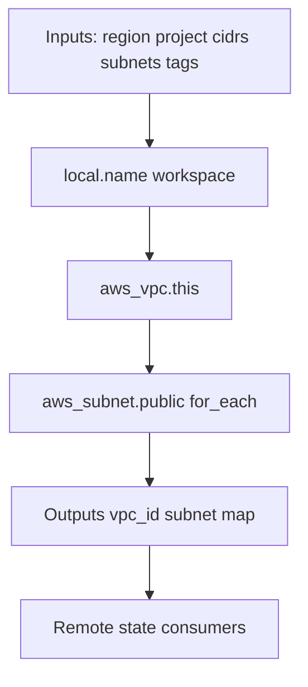

# Project Design and Capstones

A Terraform **root module** is a deployable unit with its own state, provider configuration, and ownership boundary. Lab 15 capstone combines workspace naming, map-driven subnets, tagging, and outputs into a VPC project suitable for multi-environment expansion.

## Table of contents

1. [Root module anatomy](#root-module-anatomy)
2. [Ownership boundaries](#ownership-boundaries)
3. [Multi-environment strategies](#multi-environment-strategies)
4. [Variable design](#variable-design)
5. [Tagging standards](#tagging-standards)
6. [Output contracts](#output-contracts)
7. [Capstone architecture](#capstone-architecture)
8. [Delivery workflow](#delivery-workflow)
9. [Troubleshooting](#troubleshooting)
10. [Lab cross-reference](#lab-cross-reference)

## Root module anatomy

```
lab15-capstone-projects/
├── main.tf              # Resources and provider
├── variables.tf         # Typed inputs
└── terraform.tfvars.example
```

```hcl
terraform {
  required_version = ">= 1.5.0"
  required_providers {
    aws = { source = "hashicorp/aws", version = "~> 5.0" }
  }
}
provider "aws" { region = var.aws_region }
```

Every root module should pin Terraform and provider versions.

## Ownership boundaries

```mermaid
graph TB
    subgraph Network State
        VPC[aws_vpc]
        SUB[aws_subnet public]
    end
    subgraph App State
        EC2[aws_instance]
    end
    Network State -->|terraform_remote_state outputs| App State
```

**Rule:** If teams deploy independently, split state. Network team owns VPC state; application team consumes `vpc_id` and `public_subnet_ids`.

## Multi-environment strategies

| Strategy | When | Lab connection |
|----------|------|----------------|
| Workspaces | Same code, minor input diffs | Lab 06, Lab 15 `terraform.workspace` |
| Separate directories | Materially different modules | Production platforms |
| Separate state keys | Same code, isolated state | Labs 07–08 |

Lab 15 uses workspace in naming:

```hcl
locals { name = "${var.project}-${terraform.workspace}" }
```

Default workspace → `capstone-default`. Create `dev`:

```bash
terraform workspace new dev
terraform workspace select dev
```

## Variable design

Use explicit object types (`variables.tf`):

```hcl
variable "public_subnets" {
  type = map(object({ cidr = string, az = string }))
  default = {
    public_a = { cidr = "10.50.1.0/24", az = "us-east-1a" }
    public_b = { cidr = "10.50.2.0/24", az = "us-east-1b" }
  }
}
```

### Variable validation (recommended extension)

```hcl
variable "vpc_cidr" {
  type = string
  validation {
    condition     = can(cidrhost(var.vpc_cidr, 0))
    error_message = "vpc_cidr must be valid CIDR notation."
  }
}
```

## Tagging standards

```hcl
tags = merge(var.tags, { Name = "${local.name}-${each.key}" })
```

Platform tags in `var.tags`:

```hcl
default = { managed_by = "terraform", course = "extended" }
```

Add `environment`, `cost_center`, `owner` per organizational policy.

## Output contracts

Lab 15 exports:

```hcl
output "vpc_id" { value = aws_vpc.this.id }
output "public_subnet_ids" {
  value = { for name, subnet in aws_subnet.public : name => subnet.id }
}
```

Consumers (Lab 11 pattern) depend on these names — treat renames as breaking changes.

## Capstone architecture



Resources in `main.tf`:

```hcl
resource "aws_vpc" "this" {
  cidr_block           = var.vpc_cidr
  enable_dns_hostnames = true
  tags                 = merge(var.tags, { Name = local.name })
}

resource "aws_subnet" "public" {
  for_each                = var.public_subnets
  vpc_id                  = aws_vpc.this.id
  cidr_block              = each.value.cidr
  availability_zone       = each.value.az
  map_public_ip_on_launch = true
  tags                    = merge(var.tags, { Name = "${local.name}-${each.key}" })
}
```

## Delivery workflow

1. `terraform fmt -recursive`
2. `terraform init`
3. `terraform validate`
4. `terraform plan` — peer review
5. Approved `terraform apply`
6. Verify outputs and AWS console
7. `terraform destroy` for training resources

### CI integration sketch

```yaml
- run: terraform fmt -check -recursive
- run: terraform init -backend=false
- run: terraform validate
- run: terraform plan -out=plan.tfplan
# manual approval gate
- run: terraform apply plan.tfplan
```

## Troubleshooting

| Symptom | Likely cause | Fix |
|---------|--------------|-----|
| Subnet CIDR conflict | Overlap in map | Fix `public_subnets` values |
| Wrong account | AWS_PROFILE | `aws sts get-caller-identity` |
| AZ not found | Region/AZ mismatch | Match `aws_region` to valid AZ |
| Recreate all subnets | Renamed map keys | Keys are addresses — renames replace |
| No default VPC routes | Lab creates VPC only | Add IGW/routes in extended exercise |

## Lab cross-reference

| Lab | Topic |
|-----|-------|
| 15 | Capstone VPC | `labs/lab15-capstone-projects/` |
| 11 | Consumer pattern | `labs/lab11-remote-state-consumer/` |
| 12 | Map/for_each | `labs/lab12-collections/` |

Interactive guide: `html/projects.html`

## Related resources

| Resource | Path |
|----------|------|
| Interactive guide | `terraform/extended/html/` |
| Lab configuration | `terraform/extended/labs/` |
| Course README | `terraform/extended/README.md` |

---
*Terraform Extended curriculum — validation-first, destroy training resources when finished.*

<!-- expansion:projects -->
## Appendix A — Root module checklist (extended)

Before merging a root module to main:

- [ ] `required_version` and provider pins present
- [ ] Variables typed with descriptions
- [ ] Sensitive inputs marked `sensitive = true`
- [ ] Outputs documented as consumer contracts
- [ ] `terraform fmt -check` passes in CI
- [ ] `terraform validate` passes with `-backend=false`
- [ ] README or lab manual lists prerequisites and cleanup
- [ ] No credentials in tracked files

## Appendix B — Environment matrix

| Dimension | Workspace | Separate directory | Separate state key |
|-----------|-----------|-------------------|-------------------|
| Isolation | State only | Code + state | State |
| Drift risk | Medium | Low | Medium |
| CI complexity | Low | High | Medium |
| Lab reference | 06, 15 | — | 07–08 |

Choose based on blast radius — not convenience alone.

## Appendix C — Tagging policy template

```hcl
variable "tags" {
  type = map(string)
  default = {
    managed_by = "terraform"
    owner      = "platform-team"
    cost_center = "training"
  }
}
```

Merge at resource level:

```hcl
tags = merge(var.tags, { Name = local.name, environment = terraform.workspace })
```

## Appendix D — Output versioning

Treat outputs like APIs:

| Change | Consumer impact |
|--------|-----------------|
| Add output | Safe |
| Remove output | Breaking |
| Rename output | Breaking |
| Change type | Breaking |

Document changes in CHANGELOG when modules serve multiple teams.

## Appendix E — Capstone extension ideas

After Lab 15, extend the root module with:

1. Internet gateway + public route table
2. NAT gateway (watch cost in training accounts)
3. `terraform_remote_state` consumer reading `vpc_id`
4. S3 backend with keys from Lab 08 pattern
5. Variable validation on `vpc_cidr` and subnet overlap

## Appendix — Additional reading

- [Terraform expressions](https://developer.hashicorp.com/terraform/language/expressions)
- [Provisioners](https://developer.hashicorp.com/terraform/language/resources/provisioners/connection)
- [State](https://developer.hashicorp.com/terraform/language/state)

## Appendix — Additional reading

- [Terraform expressions](https://developer.hashicorp.com/terraform/language/expressions)
- [Provisioners](https://developer.hashicorp.com/terraform/language/resources/provisioners/connection)
- [State](https://developer.hashicorp.com/terraform/language/state)

## Appendix — Additional reading

- [Terraform expressions](https://developer.hashicorp.com/terraform/language/expressions)
- [Provisioners](https://developer.hashicorp.com/terraform/language/resources/provisioners/connection)
- [State](https://developer.hashicorp.com/terraform/language/state)

## Appendix — Additional reading

- [Terraform expressions](https://developer.hashicorp.com/terraform/language/expressions)
- [Provisioners](https://developer.hashicorp.com/terraform/language/resources/provisioners/connection)
- [State](https://developer.hashicorp.com/terraform/language/state)
