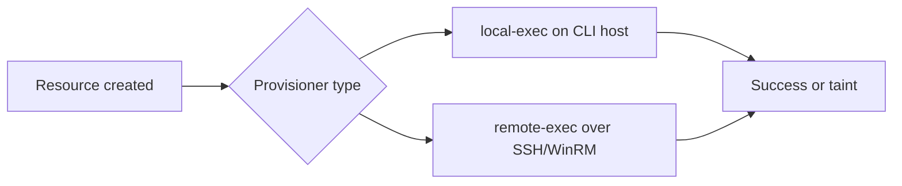

# Provisioners

Provisioners invoke scripts during resource lifecycle events. HashiCorp designates them an **escape hatch** — reach for cloud-init, golden images, or configuration management before adding provisioners to production modules.

Labs 04–05 demonstrate `local-exec` and `remote-exec` with `terraform_data` resources.

## Table of contents

1. [Provisioner fundamentals](#provisioner-fundamentals)
2. [Lifecycle timing](#lifecycle-timing)
3. [local-exec](#local-exec)
4. [remote-exec](#remote-exec)
5. [Connection blocks](#connection-blocks)
6. [When NOT to use provisioners](#when-not-to-use-provisioners)
7. [Failure and taint behavior](#failure-and-taint-behavior)
8. [Security considerations](#security-considerations)
9. [Troubleshooting](#troubleshooting)
10. [Lab cross-reference](#lab-cross-reference)

## Provisioner fundamentals

Provisioners are declared inside `resource` or `terraform_data` blocks:

```hcl
provisioner "local-exec" {
  command = "echo hello"
}
```

Supported types include `local-exec`, `remote-exec`, `file`, and vendor-specific hooks. This curriculum focuses on the first two.



## Lifecycle timing

| Event | Default provisioner | `when = destroy` |
|-------|--------------------|--------------------|
| Create | Runs after create | N/A |
| Update in-place | Does not re-run | N/A |
| Replace | Runs on new instance | Destroy hook on old |
| Destroy | Skipped | Runs before destroy |

**Important:** Provisioners do not run on every `terraform apply` — only on create/replace (and destroy if configured).

### lifecycle block interaction

```hcl
lifecycle {
  create_before_destroy = true
  prevent_destroy       = false
  ignore_changes        = [tags["volatile"]]
}
```

`create_before_destroy` affects ordering when provisioners exist on both old and new instances.

## local-exec

**Lab 04** (`lab04-local-exec-provisioner/main.tf`):

```hcl
resource "terraform_data" "local_action" {
  input = var.message
  provisioner "local-exec" {
    command = "printf '%s\n' '${self.input}'"
  }
}
```

Runs on the machine executing Terraform (laptop, CI agent, bastion).

### Appropriate uses

- Emitting a local marker file after infrastructure creation
- Triggering a tightly coupled one-shot webhook
- Training demonstrations

### Inappropriate uses

- Installing packages at scale
- Application deployment pipelines
- Ongoing configuration drift remediation

### Environment and working directory

```hcl
provisioner "local-exec" {
  command     = "./scripts/post-apply.sh"
  working_dir = path.module
  environment = {
    TF_ENV = terraform.workspace
  }
}
```

Test scripts outside Terraform first:

```bash
printf '%s\n' 'local-exec completed'
```

## remote-exec

**Lab 05** (`lab05-remote-exec-provisioner/main.tf`):

```hcl
resource "terraform_data" "bootstrap" {
  input = var.host
  connection {
    type        = "ssh"
    host        = var.host
    user        = var.user
    private_key = file(pathexpand(var.private_key_path))
  }
  provisioner "remote-exec" {
    inline = ["echo Terraform remote-exec connected to $(hostname)"]
  }
}
```

**Critical:** Lab 05 does not create the target host. You supply a reachable SSH endpoint via `terraform.tfvars`.

### terraform.tfvars.example

```hcl
host             = "203.0.113.10"
user             = "ec2-user"
private_key_path = "~/.ssh/lab-key.pem"
```

Use environment variables for CI:

```bash
export TF_VAR_host=203.0.113.10
export TF_VAR_private_key_path=~/.ssh/lab-key.pem
```

## Connection blocks

`connection` configures transport for `remote-exec` and `file` provisioners:

| Argument | Purpose |
|----------|---------|
| `type` | `ssh` or `winrm` |
| `host` | Target address |
| `user` | Login user |
| `private_key` | SSH key contents |
| `password` | Avoid in production |
| `timeout` | Connection wait |

Use `file(pathexpand(var.private_key_path))` so `~` expands correctly.

## When NOT to use provisioners

| Need | Better approach |
|------|-----------------|
| Boot-time packages | cloud-init / user_data |
| Golden OS image | Packer |
| Ongoing config | Ansible, Chef, SSM |
| Secrets on instance | Secrets Manager + IAM role |
| Database schema | Migration tool in CI/CD |
| Health checks | Load balancer / K8s probes |

HashiCorp documentation explicitly discourages provisioners for general configuration management.

## Failure and taint behavior

When a create-time provisioner fails:

1. Resource is marked tainted
2. Next apply attempts replacement (unless untainted manually)
3. Partial infrastructure may exist in cloud

```hcl
provisioner "local-exec" {
  on_failure = fail   # default — fail the apply
}
```

`on_failure = continue` is rarely appropriate — it hides operational failures.

### Destroy provisioners

```hcl
provisioner "local-exec" {
  when    = destroy
  command = "echo cleanup"
}
```

Dependencies may already be deleted during destroy. Prefer external cleanup jobs with explicit dependencies.

## Security considerations

- Never commit private keys or `terraform.tfvars` with secrets
- Mark `private_key_path` variable as `sensitive = true`
- Scope SSH keys to lab hosts; rotate after training
- `remote-exec` over internet requires security group rules — minimize exposure
- Audit provisioner commands — they run with operator privileges

## Troubleshooting

| Symptom | Likely cause | Fix |
|---------|--------------|-----|
| `connection refused` | SG, wrong IP, SSH not ready | Verify connectivity with `ssh` manually |
| `permission denied (publickey)` | Wrong key or user | Check `private_key_path` and `user` |
| Provisioner succeeds but resource tainted | Non-zero exit in script | Test command; check `set -e` in scripts |
| Destroy provisioner fails | Network already gone | Remove destroy provisioner or use external cleanup |
| Variable not set | Missing tfvars | Copy `terraform.tfvars.example` |

### Manual SSH test (Lab 05)

```bash
ssh -i ~/.ssh/lab-key.pem ec2-user@203.0.113.10 hostname
```

## Lab cross-reference

| Lab | Focus | Directory |
|-----|-------|-----------|
| 04 | local-exec | `labs/lab04-local-exec-provisioner/` |
| 05 | remote-exec | `labs/lab05-remote-exec-provisioner/` |

Interactive guide: `html/provisioners.html`

## Related resources

| Resource | Path |
|----------|------|
| Interactive guide | `terraform/extended/html/` |
| Lab configuration | `terraform/extended/labs/` |
| Course README | `terraform/extended/README.md` |

---
*Terraform Extended curriculum — validation-first, destroy training resources when finished.*

<!-- expansion:provisioners -->
## Appendix A — Provisioner decision tree

```text
Need configuration on instance?
  ├─ At boot → user_data / cloud-init
  ├─ Golden image → Packer
  ├─ Ongoing → Ansible / SSM
  └─ One-shot debug → provisioner (labs only)
```

## Appendix B — local-exec hardening

- Use absolute paths or `working_dir = path.module`
- Avoid secrets in command strings — use environment block
- Set `on_failure = fail` unless you have compensating controls
- Log to stdout for CI visibility
- Test scripts independently before `terraform apply`

## Appendix C — remote-exec prerequisites

| Prerequisite | Verification |
|--------------|--------------|
| SSH reachable | `ssh user@host true` |
| Correct user | AMI docs / `/etc/passwd` |
| Key permissions | `chmod 600` on pem |
| SFTP subsystem | OpenSSH default |
| Bastion path | Jump host ProxyCommand |

## Appendix D — CI/CD interaction

Provisioners run where `terraform apply` runs. CI agents need:

- Network path to targets (for remote-exec)
- Installed SSH client
- Injected `TF_VAR_private_key_path` via secret store
- Adequate timeout for slow boots

Local-exec runs on the agent — never assume laptop paths in CI.

## Appendix E — Replacement and taint scenarios

| Action | Provisioner runs? |
|--------|-----------------|
| First create | Yes (create) |
| No-op apply | No |
| In-place update | No (default) |
| Taint + apply | Yes (replace) |
| Destroy | Only if `when = destroy` |

Use `terraform taint` in Lab 04 to observe re-run behavior safely.

## Appendix — Additional reading

- [Terraform expressions](https://developer.hashicorp.com/terraform/language/expressions)
- [Provisioners](https://developer.hashicorp.com/terraform/language/resources/provisioners/connection)
- [State](https://developer.hashicorp.com/terraform/language/state)
