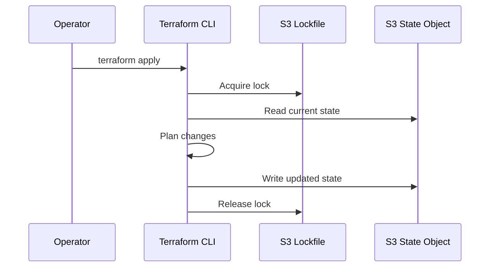
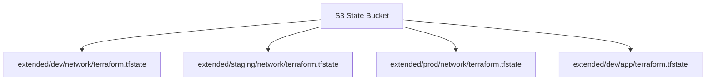

# State and Shared Ownership

Terraform state is the mapping between your configuration and real infrastructure. Without accurate state, Terraform cannot plan changes safely. This guide covers remote backends, locking, key design, migration, and consumption patterns used in Labs 07–11.

## Table of contents

1. [What state contains](#what-state-contains)
2. [Local vs remote state](#local-vs-remote-state)
3. [S3 backend configuration](#s3-backend-configuration)
4. [Locking strategies](#locking-strategies)
5. [State key naming](#state-key-naming)
6. [Migration workflow](#migration-workflow)
7. [Remote state data sources](#remote-state-data-sources)
8. [Security and compliance](#security-and-compliance)
9. [Troubleshooting](#troubleshooting)
10. [Lab cross-reference](#lab-cross-reference)

## What state contains

Terraform state is JSON (protocol version 4 in modern Terraform) storing:

- Resource instance addresses (`aws_vpc.this`, `aws_subnet.public["public_a"]`)
- Provider-assigned IDs needed for updates and destroys
- Dependency graph metadata
- Serial number and lineage for consistency checks
- Sometimes sensitive values (even when CLI output is redacted)

```text
State is NOT:
  - A source of truth for application data
  - A discovery/catalog service for all cloud resources
  - Safe to edit manually except in expert recovery scenarios

State IS:
  - Required for every plan and apply
  - A team coordination artifact in shared environments
  - Sensitive operational data
```

### State flow diagram



## Local vs remote state

| Aspect | Local (`terraform.tfstate`) | Remote (S3 backend) |
|--------|----------------------------|---------------------|
| Collaboration | Single machine | Team + CI |
| Locking | None | S3 lockfile or DynamoDB |
| Backup | Manual copy | S3 versioning |
| Risk | Lost laptop = lost state | IAM misconfig = exposure |

**Lab 07** starts with local validation (`terraform init -backend=false`) then connects to S3. This two-phase approach prevents accidental writes to wrong buckets during syntax checks.

## S3 backend configuration

Backend settings cannot reference input variables. Use a reviewed `backend.hcl` file:

```hcl
bucket       = "your-unique-terraform-state-bucket"
key          = "extended/dev/network/terraform.tfstate"
region       = "us-east-1"
encrypt      = true
use_lockfile = true
```

Root module (`lab07-s3-backend/main.tf`):

```hcl
terraform {
  required_version = ">= 1.5.0"
  backend "s3" {}
}

resource "terraform_data" "state_owner" {
  input = "shared-state"
}
```

### Initialization commands

```bash
# Phase 1: syntax and provider install only
terraform init -backend=false
terraform validate

# Phase 2: connect remote backend
cp backend.hcl.example backend.hcl   # edit bucket and key
terraform init -backend-config=backend.hcl
```

**Validate:** `Terraform has been successfully configured!` and backend path shown in `.terraform/terraform.tfstate` backend section.

### IAM minimum permissions (conceptual)

Operators typically need on the state bucket:

- `s3:GetObject`, `s3:PutObject`, `s3:DeleteObject` on `arn:aws:s3:::bucket/extended/*`
- `s3:ListBucket` with prefix condition
- For lockfiles: same object prefix write access

Use least privilege scoped to state prefix, not entire account.

## Locking strategies

Concurrent `terraform apply` without locking can corrupt state. Two common patterns:

### S3 native lockfile (`use_lockfile = true`)

Terraform 1.11+ can store locks in S3 alongside state. **Lab 09** demonstrates this pattern. No DynamoDB table required.

```hcl
use_lockfile = true
```

### DynamoDB table (legacy)

```hcl
dynamodb_table = "terraform-locks"
```

Choose one strategy per organization. Do not mix inconsistently across teams.

### Lock failure symptoms

```text
Error: Error acquiring the state lock
Lock Info:
  ID:        xxxxx
  Who:       user@host
  Created:   2026-07-17 ...
```

**Never** delete locks blindly. Contact the lock holder or verify the CI job completed. If a job crashed, use `terraform force-unlock LOCK_ID` only after confirming no active apply.

## State key naming

**Lab 08** encodes recommended key structure:

```hcl
locals {
  recommended_key = "extended/${var.environment}/network/terraform.tfstate"
}
```

### Naming conventions

| Pattern | Example key | When to use |
|---------|-------------|-------------|
| env/component | `extended/dev/network/terraform.tfstate` | Standard platform layout |
| lab isolation | `extended/lab07/terraform.tfstate` | Training sandboxes |
| account prefix | `acct-123456789012/network/terraform.tfstate` | Multi-account landing zones |
| workspace | `env:/staging/network/terraform.tfstate` | Workspace-based isolation |

**Rule:** One root module ownership boundary = one state key. Splitting by blast radius beats monolithic state.



## Migration workflow

**Lab 10** covers `terraform init -migrate-state`.

### Pre-migration checklist

1. Backup `terraform.tfstate` and `terraform.tfstate.backup`
2. Confirm destination bucket, region, and key with a peer
3. Enable S3 versioning on the bucket
4. Run `terraform state list` and capture output
5. Ensure no other operator is applying

### Migration commands

```bash
cp backend.hcl.example backend.hcl
# edit bucket, key, region

terraform init -backend-config=backend.hcl -migrate-state
# Answer yes only after reviewing the prompt

terraform state list
terraform plan   # expect no changes if migration only
```

### Rollback

If migration fails mid-flight:

1. Do not apply new changes
2. Restore from local backup or S3 version
3. Re-init with previous backend config
4. Document incident for platform team

## Remote state data sources

**Lab 11** reads upstream outputs via `terraform_remote_state`:

```hcl
data "terraform_remote_state" "network" {
  backend = "local"
  config = {
    path = var.network_state_path
  }
}

output "upstream_outputs" {
  value = data.terraform_remote_state.network.outputs
}
```

Production uses S3 backend in the data source:

```hcl
data "terraform_remote_state" "network" {
  backend = "s3"
  config = {
    bucket = "your-state-bucket"
    key    = "extended/dev/network/terraform.tfstate"
    region = "us-east-1"
  }
}
```

### Consumer design rules

- Export **narrow** outputs from producer (vpc_id, subnet ids)
- Version output contracts — breaking output renames hurt consumers
- Do not use remote state as inventory for unrelated resources
- Prefer explicit data sources for shared services when appropriate

## Security and compliance

| Control | Implementation |
|---------|----------------|
| Encryption at rest | `encrypt = true` on S3 backend |
| Encryption in transit | HTTPS to AWS APIs (default) |
| Access control | IAM policies on bucket prefix |
| Versioning | S3 bucket versioning enabled |
| Audit | CloudTrail data events on bucket |
| Secrets | Never commit state; restrict download |

State may contain private IPs, ARNs, and occasionally sensitive attributes. Treat downloaded state like credentials.

## Troubleshooting

| Symptom | Likely cause | Fix |
|---------|--------------|-----|
| `Backend configuration changed` | Key or bucket edited | Run `terraform init -reconfigure` after review |
| `AccessDenied` on PutObject | IAM or bucket policy | Verify role and prefix |
| `region mismatch` | backend.hcl region ≠ bucket region | Align region with bucket location |
| Plan wants to recreate everything | Wrong state file / empty state | STOP — verify key and workspace |
| Lock held indefinitely | Crashed CI job | Verify no active job; `force-unlock` last resort |
| `terraform_remote_state` empty outputs | Producer not applied | Apply producer first |

### Diagnostic commands

```bash
terraform version
terraform workspace show
terraform init -backend=false && terraform validate
aws sts get-caller-identity
terraform state list
terraform state show 'aws_vpc.this'
```

## Lab cross-reference

| Lab | Topic | Key file |
|-----|-------|----------|
| 07 | S3 backend init | `labs/lab07-s3-backend/main.tf` |
| 08 | State keys | `labs/lab08-state-keys/main.tf` |
| 09 | Locking | `labs/lab09-state-locking/main.tf` |
| 10 | Migration | `labs/lab10-state-migration/main.tf` |
| 11 | Consumer | `labs/lab11-remote-state-consumer/main.tf` |

Interactive diagram: `html/state.html`

## Related resources

| Resource | Path |
|----------|------|
| Interactive guide | `terraform/extended/html/` |
| Lab configuration | `terraform/extended/labs/` |
| Course README | `terraform/extended/README.md` |

---
*Terraform Extended curriculum — validation-first, destroy training resources when finished.*
